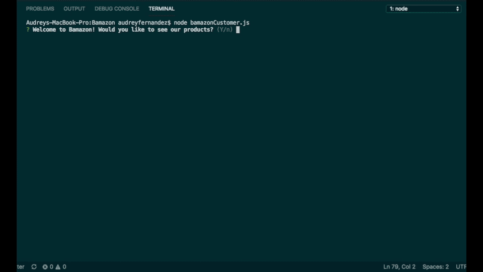

## Bamazon mySql Node Application

In this assignment, we were asked to create an Amazon type store front that can be run in the terminal that links to a local database of products, allowing the user to browse and purchase a small variety of items from the database.

To use the app you will first need to copy the schema file to create the database. Then all required NPM packages will need to be installed. Intialize the app by typing node bamazonCustomer.js into the terminal. Answer the questions and follwo the prompts to view and purchase from the current inventory.

# Technologies Used and Requirements

* Javascript
* jQuery
* Node.js
* MySql Workbench
* MySql NPM Package
* Inquirer NPM Package

# Screenshots

